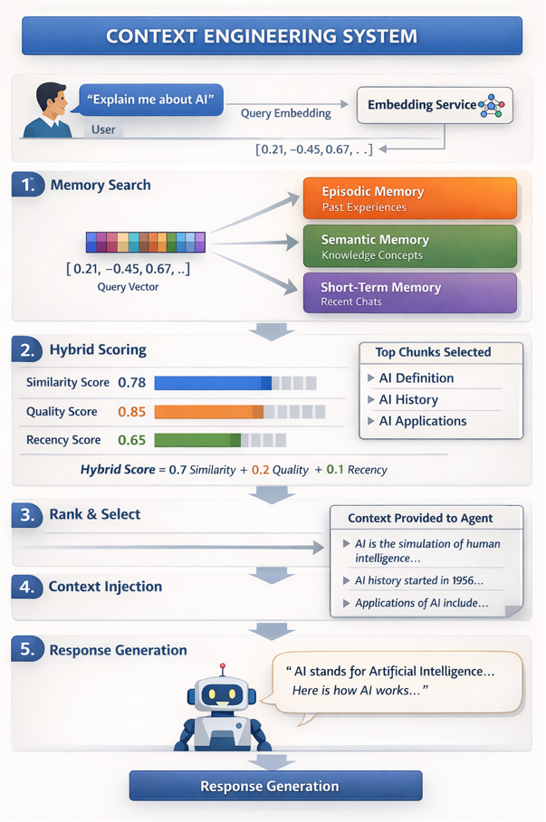

# 🚁 Production-Grade Multi-Agent Orchestration Framework

---

## 🚀 Overview

This is an enterprise-grade multi-agent orchestration system designed to safely execute autonomous AI workflows at scale.

Think of it as an **Air Traffic Control (ATC) system for AI agents**.

Just like ATC:

* Coordinates multiple independent agents
* Enforces strict safety and security rules
* Tracks every action in real time
* Prevents unsafe or inefficient execution

Agents collaborate intelligently within strict boundaries of:

* 🔐 Security
* 💸 Cost
* 📊 Observability
* ⚙️ Reliability

---

# 🧠 Framework Overview & Core Techniques

This is not just an agent pipeline — it is a **production-grade system for building reliable, safe, and scalable agentic applications**.

---

## ⚙️ Core Techniques

### 🧠 Multi-Agent Decomposition

Break complex queries into structured steps handled by specialized agents.

→ Improves reasoning quality and reduces hallucinations

---

### 🔄 State-Based Orchestration (Blackboard Pattern)

All agents communicate through a shared state instead of direct messaging.

→ Enables loose coupling and better traceability

---

### 🧭 Graph-Based Execution (LangGraph)

Workflows are defined as a **stateful graph**, not a linear chain.

→ Supports loops, retries, and dynamic execution paths

---

### 🔐 Zero-Trust Security Model

Every interaction (user, agent, tool) is verified.

→ Prevents unauthorized actions and internal abuse

---

### 🎟️ JIT (Just-In-Time) Privileges

Agents receive temporary scoped permissions.

→ Minimizes risk and reduces attack surface

---

### 💸 Budget-Aware Execution

Tracks tokens, tool calls, and runtime.

→ Prevents cost overruns and infinite loops

---

### 📊 Observability-First Design

Full tracing, logging, and metrics.

→ Makes the system debuggable and production-ready

---

### 🧠 Context Engineering

Layered memory system (short-term, episodic, semantic).

→ Enables context-aware and personalized responses

---

## 🧩 Mental Model

* Agents → Aircraft
* Orchestrator → Air Traffic Control
* State → Airspace
* Security → Flight rules
* Budget → Fuel
* Observability → Radar

---

# 🏗️ Architecture: Layer-by-Layer Breakdown

## ✈️ 1. Ingress & Security Gateway

### What it does

* JWT authentication
* RBAC authorization
* Prompt injection detection
* Request validation
* Trace initialization

### Why it matters

Acts as the **secure entry point** to the system.

### If missing

* 🚨 Unauthorized access
* 🔓 Prompt injection attacks
* 💸 Uncontrolled usage

---

## 🧭 2. Orchestrator (Strategic Core)

### What it does

* Breaks tasks into steps (Planner)
* Routes execution (Delegator)
* Coordinates agents (Graph execution)

### Why it matters

Transforms raw queries into structured workflows.

### If missing

* ❌ No multi-step reasoning
* 🤖 Monolithic LLM behavior

---

## 🔄 3. Shared State Bus (AgentState)

### What it does

* Stores messages, context, results
* Tracks execution progress
* Enables agent communication

### Why it matters

Provides a **single source of truth**.

### If missing

* ❌ No coordination
* 🔁 Duplicate computation

---

## 🧠 4. Context Engineering System

### Components

* Short-Term Memory (session)
* Episodic Memory (past interactions)
* Semantic Memory (knowledge base)

### What it does

Retrieves, validates, and injects context into agent prompts.

### Why it matters

Improves accuracy, personalization, and efficiency.

### If missing

* 🤯 Stateless system
* 📉 Poor response quality

---

## 🧩 5. Execution Layer (Agents)

### Core Agents

* Planner → creates plan
* Researcher → fetches data
* Critic → validates output

### Why it matters

Specialization leads to **better reasoning and reliability**.

### If missing

* ❌ Weak outputs
* ❌ No validation

---

## 🛠️ 6. Tooling Layer

### What it does

* External APIs (search, data)
* Tool execution via MCP

### Why it matters

Connects agents to the real world.

### If missing

* 🤖 Only theoretical reasoning
* ❌ No real data

---

## 🔐 7. Security Layer

### Components

* JWT authentication
* RBAC authorization
* Agent PKI (RSA signing)
* Zero Trust enforcement
* JIT tokens

### Why it matters

Ensures safe execution across users and agents.

### If missing

* 🚨 System compromise risk
* 🔓 Agent misuse

---

## 💸 8. Budget & Resource Governance

### What it does

* Limits tokens
* Limits tool calls
* Limits execution time

### Why it matters

Controls cost and prevents runaway execution.

### If missing

* 💸 Cost explosion
* 🔁 Infinite loops

---

## 📊 9. Observability & Monitoring

### Components

* Structured logging
* Distributed tracing (LangSmith, OTEL)
* Metrics tracking

### Why it matters

Provides full visibility into system behavior.

### If missing

* 🔍 Impossible debugging
* 💣 Silent failures

---

## 🧹 10. Failure Handling (DLQ - Future)

### What it does

Captures failed executions for retry/debugging.

### Why it matters

Improves reliability and fault tolerance.

### If missing

* ❌ Lost failures
* ❌ No recovery path

---

# 🔄 End-to-End Flow

1. User sends request
2. Gateway validates + authenticates
3. Authorization checks permissions
4. Prompt guard sanitizes input
5. Context is retrieved and injected
6. Planner creates execution plan
7. Delegator routes tasks
8. Agents execute with tools
9. Critic validates results
10. Response returned
11. Memory updated
12. Logs + traces recorded

---

# 🛠 Technology Stack

### Core Backend

* Python
* FastAPI
* Pydantic

### Orchestration

* LangGraph

### AI Models

* Groq (LLMs)

### Security

* Python-JOSE
* Passlib
* Cryptography

### Memory & Context

* FAISS / Vector DB
* Custom memory layers

### Observability

* OpenTelemetry
* LangSmith

### Tools

* Tavily Search API

---

# 🧠 Final Thought

This is not just an LLM wrapper — it is a **secure, context-aware, multi-agent operating system** that:

* Thinks in structured steps
* Remembers and learns from interactions
* Enforces strict security boundaries
* Validates its own outputs

Built for **real-world production systems**, not demos.
