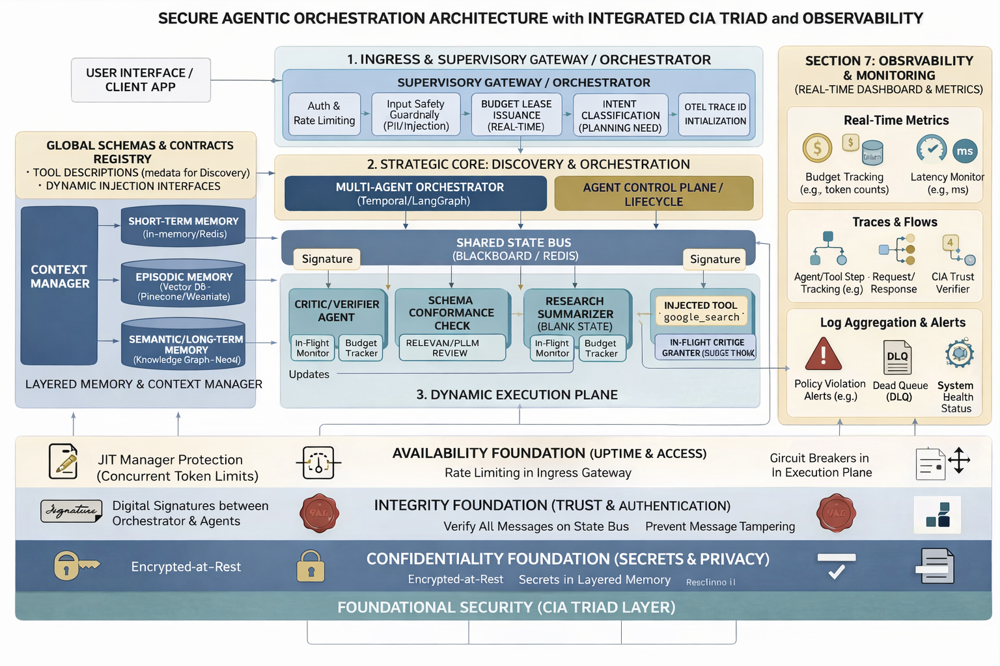

# 🚁 Production-Grade Multi-Agent Orchestration Architecture: Air Traffic Control for Agentic AI



---

## 🚀 Overview

**Enterprise-grade multi-agent orchestration system** designed to safely run autonomous AI agents at scale.

Imagine this as an advanced **Air Traffic Control (ATC) system** for AI agents.

Just like real-world ATC:
- Coordinates multiple independent aircraft  
- Enforces strict safety rules  
- Monitors everything in real time  
- Prevents collisions and unsafe behavior  


Agents collaborate intelligently — within strict boundaries of:
- 🔐 Security  
- 💸 Cost  
- 📊 Observability  
- ⚙️ Reliability  

---

# 🧠 Framework Overview & Core Techniques

This is not just a collection of agents — it is a **structured framework for building production-grade agentic systems**.

---

## ⚙️ Core Techniques

### 🧠 Multi-Agent Decomposition
Break complex tasks into smaller steps handled by specialized agents.

→ Improves reasoning, reduces hallucination, enables parallelism  

---

### 🔄 State-Based Orchestration (Blackboard Pattern)
Agents communicate via a shared state instead of direct calls.

→ Loose coupling, better traceability  

---

### 🧭 Graph-Based Execution (LangGraph)
Workflows are defined as a **stateful graph**, not linear chains.

→ Supports branching, retries, and dynamic flows  

---

### 🧱 Agent Abstraction (Strands Agents)
Standardized agent interface with built-in hooks.

→ Faster development, consistent behavior  

---

### 🔌 Dynamic Tool Calling (MCP)
Agents discover and use tools at runtime.

→ No glue code, highly extensible  

---

### 🔐 Zero-Trust Security
Every action is verified.

→ Prevents unauthorized execution  

---

### 💸 Budget-Aware Execution
Tracks tokens, time, and tool usage.

→ Prevents cost explosion  

---

### 📊 Observability-First Design
Everything is logged, traced, and measurable.

→ Debuggable and production-ready  

---

### 🧠 Layered Memory
Short-term + long-term + semantic memory.

→ Context-aware and efficient agents  

---

## 🧩 Mental Model

- Agents → Aircraft  
- Orchestrator → Air Traffic Control  
- State → Airspace  
- Security → Flight rules  
- Budget → Fuel  
- Observability → Radar  

---

# 🏗️ Architecture: Layer-by-Layer Breakdown

## ✈️ 1. Ingress & Supervisory Gateway

### What it does
- Authentication & rate limiting  
- Input validation & prompt injection protection  
- Intent classification  
- Budget allocation  
- Trace initialization  

### Why it matters
Acts as the **control tower entry point**.

### If missing
- 🚨 Security vulnerabilities  
- 💸 Uncontrolled costs  
- 🔓 Unauthorized access  

---

## 🧭 2. Strategic Core: Discovery & Orchestration

### Multi-Agent Orchestrator

### What it does
- Breaks tasks into steps  
- Routes work across agents  
- Controls execution flow  

### Why it matters
Enables **coordinated intelligence**

### If missing
- ❌ No workflows  
- 🤖 Monolithic agents  

---

### Agent Control Plane / Lifecycle

### What it does
- Manages agent lifecycle  
- Registers capabilities  
- Controls execution  

### Why it matters
Keeps the system scalable and manageable

### If missing
- Chaos in execution  
- Hard to scale  

---

## 🔄 3. Shared State Bus (Blackboard Pattern)

### What it does
- Shared communication layer for agents  
- Context exchange  
- Intermediate results storage  

### Why it matters
Enables **collaboration without tight coupling**

### If missing
- ❌ No coordination  
- 🔁 Duplicate work  

---

## 🧠 4. Layered Memory & Context Manager

### Components
- Short-term memory  
- Episodic memory  
- Semantic memory  

### What it does
Maintains context across tasks and time

### Why it matters
Improves efficiency, personalization, and accuracy

### If missing
- 🤯 Stateless system  
- 📉 Poor UX  

---

## 🧩 5. Execution Layer (Dynamic Plan)

### Core Agents
- Planner  
- Researcher  
- Summarizer  
- Critic  

### Why it matters
Specialization ensures **high-quality outputs**

### If missing
- ❌ Weak reasoning  
- ❌ Hallucinations  

---

## 🛠️ 6. Tooling Layer

### What it does
- API integrations  
- External tools  
- Search capabilities  

### Why it matters
Enables real-world interaction

### If missing
- 🤖 Only reasoning  
- ❌ No action  

---

## 📊 7. Observability & Monitoring

### Components
- Metrics  
- Tracing  
- Logging  

### Why it matters
Full visibility into system behavior

### If missing
- 🔍 No debugging  
- 💣 Silent failures  

---

## 🔐 8. Security Foundations (CIA Triad)

### Confidentiality
- Encryption, secret management  

### Integrity
- State validation, signatures  

### Availability
- Rate limiting, circuit breakers  

### Why it matters
Ensures safe, reliable execution

---

## 💸 9. Budget & Resource Governance

### What it does
- Tracks tokens, time, tool usage  

### Why it matters
Controls cost and prevents abuse

### If missing
- 💸 Cost explosion  

---

## 🚨 10. Dead Letter Queue (DLQ)

### What it does
Handles failed executions

### Why it matters
Ensures reliability

### If missing
- ❌ Lost failures  

---

# 🔄 End-to-End Flow

1. User request enters gateway  
2. Security + validation applied  
3. Budget assigned  
4. Orchestrator builds plan  
5. Agents execute collaboratively  
6. Tools invoked dynamically  
7. Critic validates output  
8. Response returned  
9. Logs + metrics recorded  

---

# 🚀 Getting Started

## Installation

```bash
git clone https://github.com/yourusername/travo-agent-solution.git
cd travo-agent-solution
python -m venv .venv
.venv\Scripts\activate
pip install -e .
